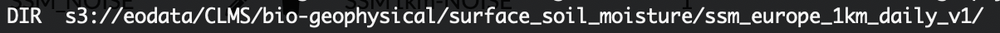
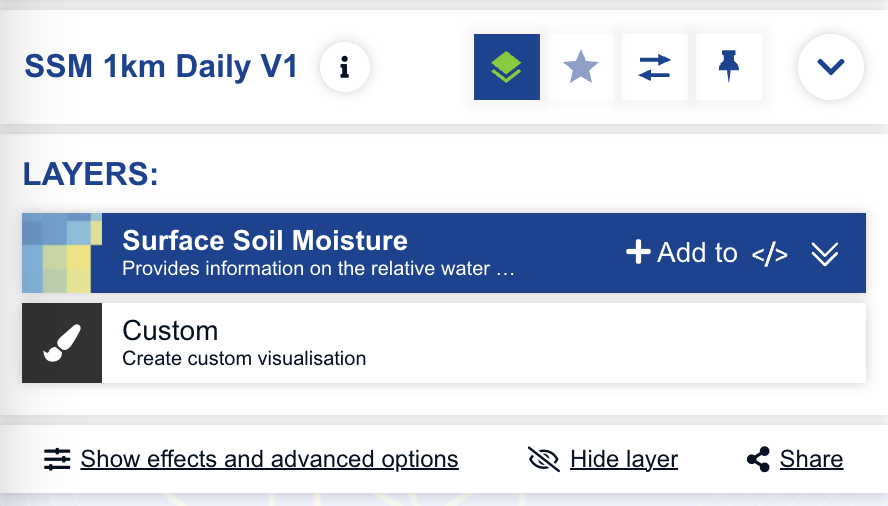
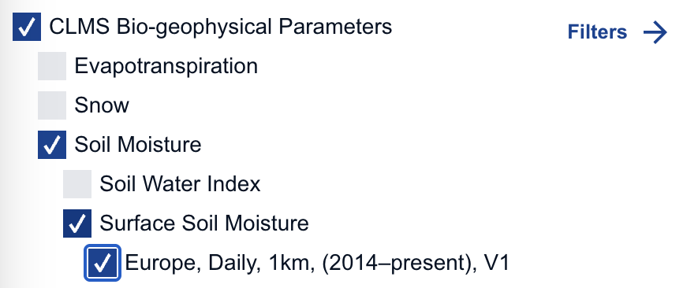
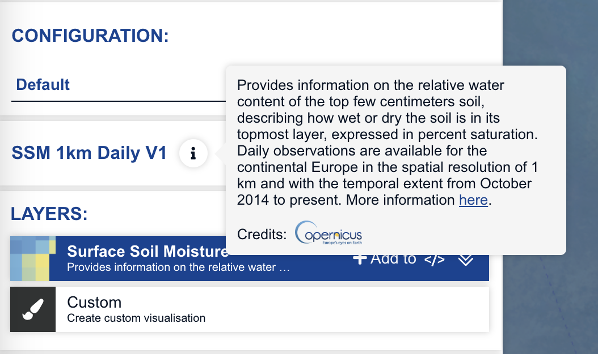
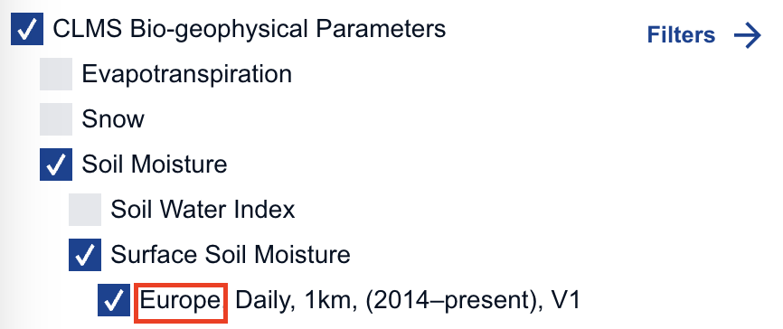
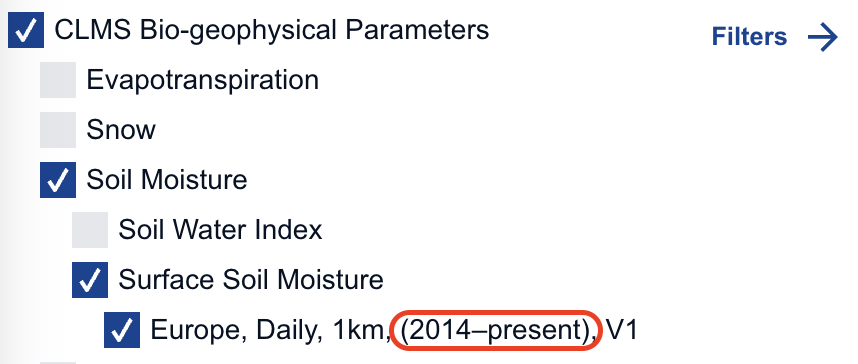
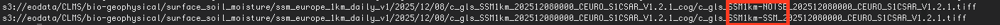
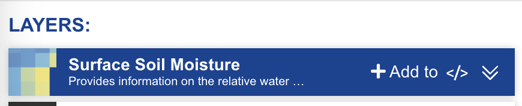
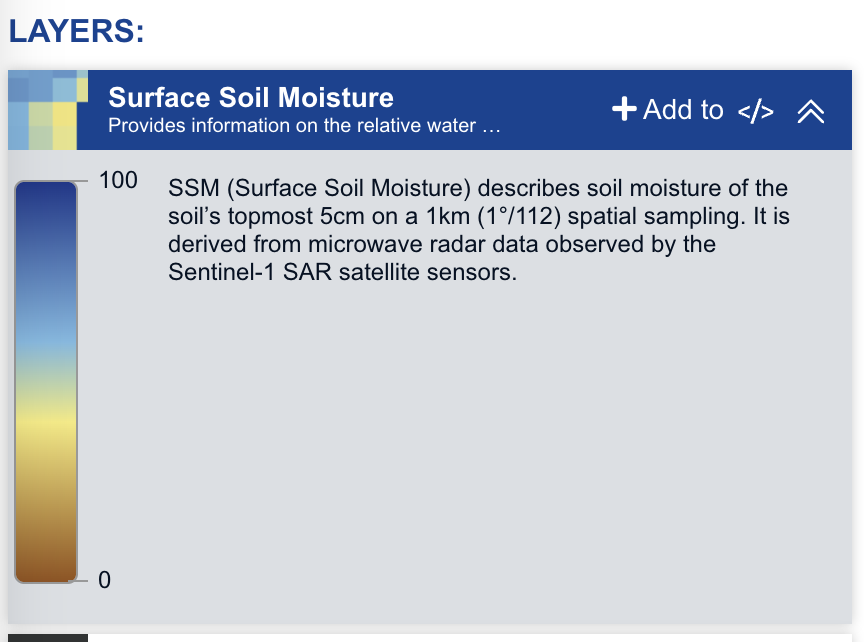

= Structure description of the proposed JSON scheme for CLMS collections (Browser integration)

== Full structure template

[source,json]
----
{
  "schemaVersion": "M.m.p",
  "name": "",
  "browserName": "",
  "browserSearchPath": "",
  "collectionDescription": "",
  "linkToCLMS": "",
  "spatialCoverage": "",
  "temporalExtent": {
    "start": "",
    "end": "",
  "thumbnailLink": ""
  },
  "layers": [
    {
      "fileName": "",
      "layerBrowserName": "",
      "shortDescription": "",
      "longDescription": "",
      "colourMapLink": "",
      "legendLink": "",
      "units": "[unit]",
      "display": 1
    }
  ]
}
----
https://github.com/copernicus-land/colourmaps-legends/tree/main/schemas/data_descriptors[source: data_descriptors schema]

== Description of variables and rules to observe

In this section we will use the collection _ssm_europe_1km_daily_v1_ as an example.

=== name

The name of the collection in _eodata_.

=== browserName

The name that should appear in the Browser when visualising the product. This should follow the convention:

----
Product Resolution Timeliness Version
----

=== browserSearchPath

The description of the structure to be implemented in the SEARCH tab of the Copernicus Browser.

=== collectionDescription

The description of the collection to be displayed when a user clicks on the information button in the VISUALISE tab.

=== linkToCLMS

The link to the product on the CLMS portal. The link will be inserted in the _collectionDescription_, with the text "More information here".

SSM 1km Daily V1:: https://land.copernicus.eu/en/products/soil-moisture/daily-surface-soil-moisture-v1.0

=== spatialCoverage

The spatial coverage of the collection. This information is used to build the name of the product in the SEARCH tab of the Browser.

=== temporalExtent

The temporal coverage of the collection. This variable contains 2 attributes: **start** and **end**. This information is used to build the name of the product in the SEARCH tab of the Browser.

==== thumbnailLink

The link to the thumbnail image in the CLMS git repository.

Note: the link must point to the dedicated folder in the CLMS git repository.

dmp global 300m 10daily v2:: https://github.com/copernicus-land/colourmaps-legends/blob/main/thumbnails/dmp_global_300m_10daily_v2/thumbnails/dmp_global_300m_10daily_v2/CLMS_DMP300mV2_Brazil_20250630.png

=== layers

An array containing the attributes for each layer contained in the collection.

IMPORTANT NOTE: The appearance order will be displayed in the CDSE browser

==== fileName

The name of the Layer contained in the path of the COG. This enables us to identify the file in the _eodata_ storage.

==== layerBrowserName

The name of the Layer to be displayed in the Browser.

==== shortDescription

The description of the layer that appears under the layer name in the Browser. This description should be less than 42 characters to be displayed in full.

==== longDescription

The description of the layer that appears when the user expands the layer.

==== units 

The unit of measure to be used in the layer.

Note 1: the unit must be enclosed in square brackets (e.g., "[m/km²]", "[%]") 
Note 2: as the ultimate goal is to represent this information in a human readable format, the convention to follow isn't the CF one (e.g., m km-2 → m/km²)

==== colourMapLink

The link to the colourmap in the Github repository governing the display of the data in the Browser.

SSM 1km Daily V1:: https://github.com/copernicus-land/colourmaps-legends/blob/main/colourmaps/ssm_europe_1km_daily_v1/clms_global_ssm_1km_v1_daily.txt

==== legendLink

The link to the legend in the Github repository that will be integrated in the layer description in the Browser.

SSM 1km Daily V1:: https://github.com/copernicus-land/colourmaps-legends/blob/main/legends/clms_global_ssm_1km_v1_daily.png

==== display

* `1` = the layer should be displayed in the Browser
* `0` = the layer is to be omitted in the Browser
